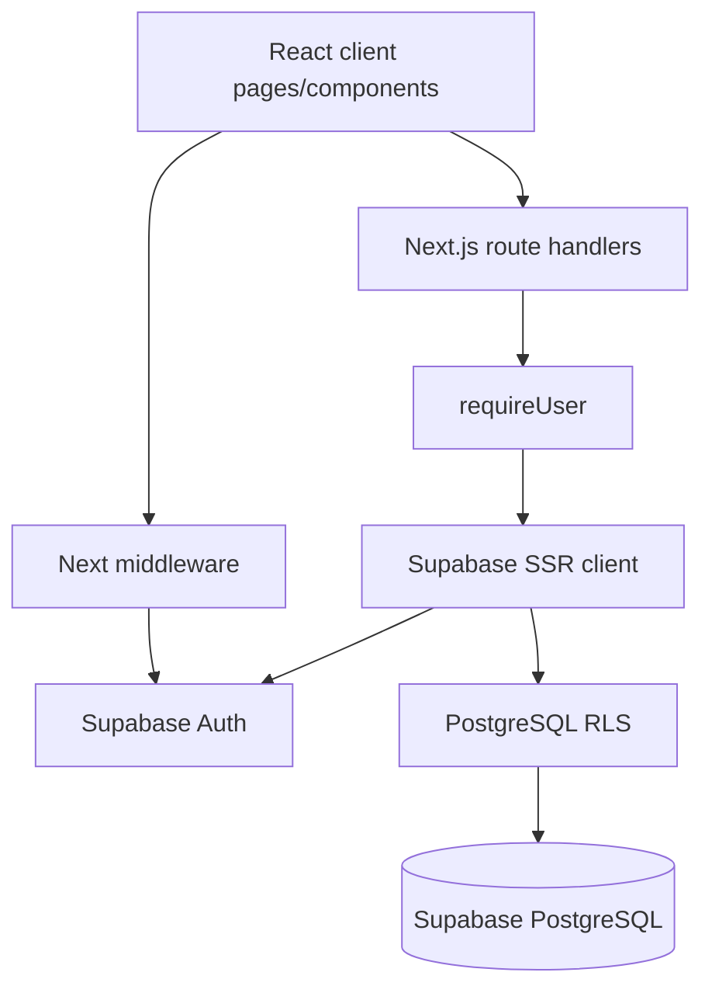
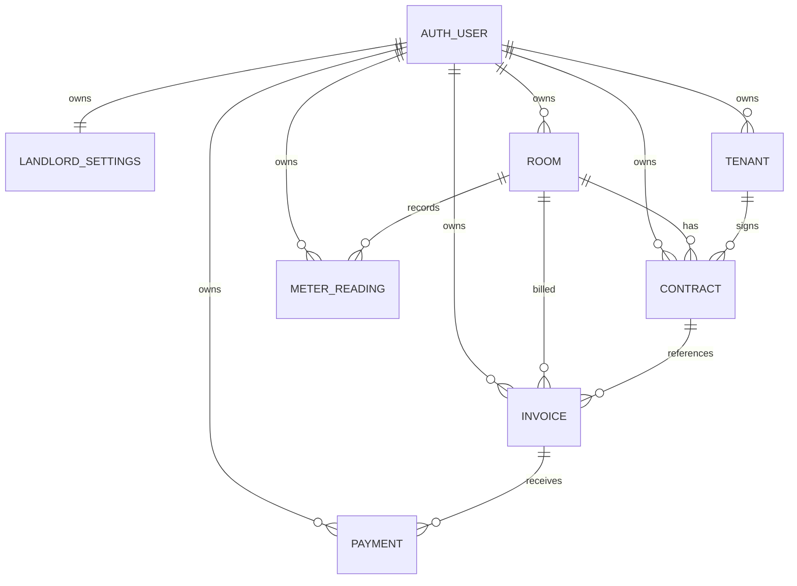
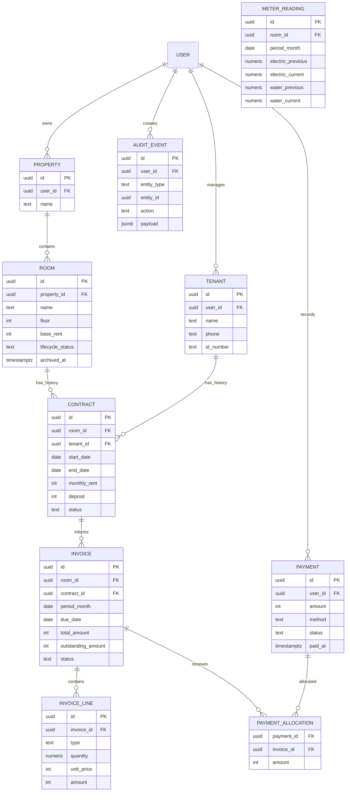
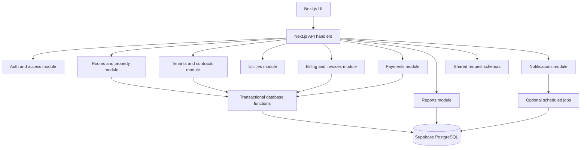

# Rental Management — Project Context

> This file is a project-context version of the existing **Rental Management Technical and Product Plan**.
> It preserves the source plan's verified facts, terminology, recommendations, roadmap, risks, and implementation backlog.
> Unknown items remain explicitly marked as `UNKNOWN — requires further investigation`.

---

## 1. Executive Summary

This is an early-stage full-stack MVP for Vietnamese landlords managing approximately 10–50 rooms.

It currently supports:

- Authentication
- Room management
- Tenant management
- Implicit room contracts
- Electricity and water readings
- Monthly invoice generation
- Cash and transfer payment recording
- Overdue tracking
- Debt reminder message generation
- Dashboard summaries
- Demo data seeding

The current architecture is appropriate for the project size: a single Next.js application backed by Supabase PostgreSQL. It is effectively a modular monolith, although module boundaries are informal.

The strongest parts are:

- Straightforward technology choice
- Supabase RLS
- Database constraints
- Usable monthly billing workflow

The most important limitations are:

- Payment and assignment mutations are not transactional.
- Partial payment semantics are undefined.
- Contract lifecycle is incomplete.
- Financial history can be deleted through room deletion cascades.
- There are no automated tests.
- TypeScript build errors are explicitly ignored.
- Legacy mock-data components coexist with the active Supabase implementation.
- Settings, documentation, and migration behavior have drifted.

### Recommended direction

Preserve the current architecture and improve it incrementally.

Stabilize:

- Financial correctness
- Validation
- Database invariants
- Testing
- Operational visibility

before adding advanced features.

---

## 2. Technology Stack

| Component | Technology | Version | Purpose |
|---|---|---:|---|
| Language | TypeScript | 5.7.3 | Application code |
| Language | SQL | UNKNOWN | PostgreSQL schema and migrations |
| Frontend framework | React | 19 | Client UI |
| Full-stack framework | Next.js App Router | 16.2.6 | Pages, layouts, middleware, API handlers |
| Runtime | Node.js | UNKNOWN | Next.js runtime |
| Database | PostgreSQL through Supabase | PostgreSQL version UNKNOWN | Persistent storage |
| Database SDK | `@supabase/supabase-js` | 2.106.2 | Database and Auth access |
| SSR integration | `@supabase/ssr` | 0.10.3 | Cookie-aware browser/server clients |
| ORM | None detected | N/A | Direct Supabase queries are used |
| Styling | Tailwind CSS | 4.2.0 | Utility styling |
| UI components | shadcn/ui-style components and Radix UI | Various | Dialogs, buttons, selects, cards, etc. |
| Icons | `lucide-react` | 0.564.0 | UI icons |
| Charts | `recharts` | 2.15.0 | Dependency is present; active reporting usage is limited or UNKNOWN |
| Forms | `react-hook-form` | 7.54.1 | Installed; active usage should be verified |
| Validation | `zod` | 3.24.1 | Installed; consistent server-side usage is not evident |
| Notifications | `sonner` | 1.7.1 | Client toast notifications |
| Date utilities | `date-fns` | 4.1.0 | Installed; core billing code mainly uses native Date |
| Build tooling | pnpm, PostCSS, TypeScript | See package files | Development and builds |
| Analytics | Vercel Analytics | 1.6.1 | Production analytics |
| Testing | UNKNOWN — no test framework or test files found | N/A | No automated test suite detected |
| Deployment | Vercel mentioned in README | UNKNOWN from source | No deployment configuration found |
| Containers | None detected | N/A | No Docker configuration |

### Important configuration files

- `package.json`
- `tsconfig.json`
- `next.config.mjs`
- `postcss.config.mjs`
- `components.json`
- `.env.example`

---

## 3. Current Repository Structure

### Application entry points

- `layout.tsx`: root HTML layout, metadata, fonts, analytics.
- `layout.tsx`: authenticated application shell.
- `page.tsx`: dashboard.
- `middleware.ts`: Supabase session middleware entry point.

### Frontend modules

- `app/(auth)/`: login and signup.
- `page.tsx`: room UI.
- `page.tsx`: tenant UI.
- `page.tsx`: meter entry route.
- `page.tsx`: invoice UI.
- `page.tsx`: payment tracking UI.
- `page.tsx`: reminder messages.
- `page.tsx`: property and pricing settings.
- `components/`: reusable application components.
- `components/ui/`: shared UI primitives.

### Backend modules

- `app/api/`: REST-style Next.js route handlers.
- `auth.ts`: authenticated API guard.
- `invoices.ts`: invoice enrichment and generation.
- `billing.ts`: billing calculations.
- `format.ts`: formatting and status calculations.

### Database modules

- `20260527084307_initial.sql`: initial schema, triggers, and RLS.
- `20260530143343_add_garbage_price_into_landlord_settings.sql`: garbage-fee column migration.
- `seed.sql`: seed-related SQL.

### Shared client infrastructure

- `client.ts`: browser client.
- `server.ts`: server client.
- `middleware.ts`: session refresh and redirects.
- `use-fetch.ts`: client GET and mutation helpers.

There is one main project. No separate frontend, backend, worker, or mobile project was found.

---

## 4. Current Architecture

### Actual request path



### Frontend/backend separation

The application has a logical separation but not a separately deployed backend:

- Client pages call `/api/...`.
- Next.js route handlers process requests.
- Route handlers use the authenticated Supabase server client.
- PostgreSQL RLS provides tenant isolation.
- Most active application pages are client components using `useFetch`, `apiPost`, and `apiPatch`.

### Layering

Current layers are approximately:

1. UI pages and components
2. Fetch helpers
3. Route handlers
4. Shared services and calculation utilities
5. Supabase client
6. PostgreSQL schema and RLS

The boundaries are not strict.

Route handlers contain:

- Request parsing
- Validation
- Authorization checks
- Business workflow orchestration
- Database writes
- Error formatting

### Validation

Validation is mostly manual:

- Required fields are checked in route handlers.
- Database constraints validate some numeric and relational rules.
- `zod` is installed but consistent server-side schema validation is not evident.
- Phone numbers, identification numbers, date formats, payment amounts, and enum values are not comprehensively validated.

### Error handling

The common pattern is:

- `401` from `requireUser()`.
- `400` for a few manually detected input errors.
- `404` for missing invoices or rooms.
- `500` for Supabase errors.

There are no:

- Structured error codes
- Centralized error handling
- Request IDs
- Server-side application logging

detected.

### Configuration

Environment variables are used for Supabase URL and anon key.

The source does not validate required environment variables at startup.

### External integrations

Verified:

- Supabase Auth
- Supabase PostgreSQL
- Vercel Analytics
- Browser phone links
- Browser Zalo links
- Clipboard API

No actual:

- SMS provider
- Zalo API
- Email provider
- Payment gateway
- Accounting integration
- Background job system

exists.

---

## 5. Current Domain Model

### Landlord settings

**Purpose:** stores per-user property configuration.

Fields include:

- `property_name`
- `electric_price`
- `water_price`
- `garbage_price`
- `invoice_due_day`
- `user_id`

Rules:

- One settings row per user.
- Automatically created by a database trigger after signup.

Missing:

- Settings history/versioning
- Multiple properties per account
- Effective dates for pricing changes

### Room

**Purpose:** physical rental unit.

Fields include:

- `name`
- `floor`
- `base_rent`
- `status`
- `sort_order`
- `notes`

Statuses:

- `occupied`
- `vacant`
- `maintenance`

CRUD:

- List
- Create
- Update
- Delete
- Filter by floor and tenant
- Assign and unassign tenants indirectly

Missing:

- Reserved, notice, or move-out states
- Room type and capacity
- Soft deletion
- Property/building ownership
- Historical state transitions

### Tenant

**Purpose:** person renting a room.

Fields include:

- `name`
- `phone`
- `id_number`
- `notes`

CRUD:

- List
- Create
- Update
- Delete
- Search by name, phone, ID, or room
- Assignment to rooms

Missing:

- Multiple occupants
- Emergency contact
- Tenant history view
- Tenant documents
- Duplicate detection policy

### Contract

**Purpose:** links a tenant to a room and stores rent terms.

Fields include:

- `room_id`
- `tenant_id`
- `start_date`
- `end_date`
- `monthly_rent`
- `deposit`
- `is_active`

CRUD:

- Implicit creation/update during room or tenant assignment.
- No dedicated contract route or screen.

Missing:

- Explicit lifecycle
- Termination and renewal
- Notice period
- Deposit collection/refund
- Contract documents
- Effective rent changes
- Database enforcement of one active contract

### Meter reading

**Purpose:** stores electricity and water readings for a room and billing period.

Fields include:

- `period_month`
- `electric_previous`
- `electric_current`
- `water_previous`
- `water_current`

Rules:

- One reading per room per period.
- Current reading cannot be lower than previous reading.
- Only occupied rooms appear in the active meter workflow.

Missing:

- Meter serial numbers
- Photo evidence
- Correction/audit history
- Meter replacement handling
- Multiple utility pricing rules

### Invoice

**Purpose:** monthly charge snapshot.

Fields include:

- Rent
- Electricity usage and cost
- Water usage and cost
- Other fees
- Total
- Due date
- Payment status
- Contract reference

Rules:

- One invoice per room per period.
- Generated for occupied rooms.
- Captures current settings and contract values at generation time.
- Status values: unpaid, paid cash, paid transfer.

Missing:

- Partial payment balance
- Discounts
- Adjustments
- Invoice correction workflow
- Versioning or audit trail
- Explicit invoice line items

### Payment

**Purpose:** records payment against an invoice.

Fields include:

- Invoice
- Amount
- Method
- Paid timestamp
- Notes

Methods:

- Cash
- Transfer

Missing:

- Receipt number
- Payment allocation
- Reconciliation state
- Refunds
- Multiple-payment semantics
- Payment audit history

### Current ERD



### Target domain model

The recommended target model should initially retain the current entities and clarify their boundaries:

- `LandlordSettings`
- `Room`
- `Tenant`
- `Contract`
- `MeterReading`
- `Invoice`
- `InvoiceLine`
- `Payment`
- `PaymentAllocation`
- `AuditEvent`

Add `Property` and `Building` only when the product genuinely requires multiple properties or buildings per landlord.

---

## 6. Current Business Flows

### Login and signup

```text
User
 ↓
login/page.tsx or signup/page.tsx
 ↓
Supabase browser Auth client
 ↓
Supabase Auth
 ↓
Session cookies refreshed by middleware
 ↓
Authenticated pages/API routes
```

Signup also causes the database trigger `handle_new_user()` to create default landlord settings.

Missing or limited:

- Password reset flow
- MFA
- Role-based permissions
- Account invitation flow
- Explicit session policy
- Login rate limiting

### Room management

```text
User
 ↓
rooms/page.tsx
 ↓
POST/PATCH/DELETE /api/rooms
 ↓
app/api/rooms/route.ts
 ↓
Supabase rooms and contracts queries
 ↓
rooms, contracts, tenants tables
```

Room assignment can deactivate existing active contracts, create a new contract, and update room status.

Potential edge cases:

- Concurrent assignments
- Room status manually set to vacant while an active contract remains
- Room hard deletion cascades financial and meter history
- Assignment writes can partially succeed

### Tenant management

```text
User
 ↓
tenants/page.tsx
 ↓
POST/PATCH/DELETE /api/tenants
 ↓
Tenant and contract orchestration in route.ts
 ↓
tenants, contracts, rooms
```

Creating or editing a tenant can assign a room and create or replace an active contract.

Potential edge cases:

- Errors from follow-up contract/room writes are not consistently handled.
- No database transaction covers the multi-step workflow.
- End dates are not applied automatically.
- Tenant deletion depends on contract deletion and can affect history.

### Rental/contract management

There is no standalone rental management module.

The actual flow is:

```text
User
 ↓
Room or tenant assignment form
 ↓
Rooms or tenants API
 ↓
Deactivate existing active contracts
 ↓
Insert a new active contract
 ↓
Update room status
 ↓
Database
```

Contract termination, renewal, notices, and historical rental views are not implemented.

### Meter reading

```text
User
 ↓
meters/page.tsx
 ↓
meter-spreadsheet.tsx or meter-cards.tsx
 ↓
POST /api/meters
 ↓
Upsert meter_readings
 ↓
meter_readings table
```

Previous-period readings become the default opening values. Database checks reject decreasing readings.

Potential edge cases:

- Incorrect but increasing readings are accepted.
- No audit history for corrections.
- Reading period format is not strongly validated.
- Meter reading entry and invoice generation are separate operations.

### Billing

```text
User
 ↓
bills/page.tsx
 ↓
POST /api/invoices/generate
 ↓
generateInvoicesForPeriod()
 ↓
Read occupied rooms, contracts, readings, settings
 ↓
Calculate and insert invoices
```

Formula:

```text
total =
  rent
  + electricity usage × electricity price
  + water usage × water price
  + garbage fee
```

Potential edge cases:

- No prorated rent.
- No move-in/move-out billing.
- No price history.
- Invoice generation uses room status rather than contract date validity.
- No invoice correction endpoint.
- Manual generation only.

### Payment

```text
User
 ↓
payments/page.tsx
 ↓
POST/PATCH /api/payments
 ↓
Insert/delete payment and update invoice status
 ↓
payments and invoices tables
```

Supported actions:

- Record payment.
- Undo payment.
- Change payment method through resubmission.

Potential edge cases:

- Partial amount can be submitted while invoice becomes fully paid.
- Multiple payments are not reflected in invoice balance.
- Payment insert and invoice update are not atomic.
- Undo deletes payment history.
- Invalid payment methods are not comprehensively rejected before database access.

### Reminders

```text
User
 ↓
reminders/page.tsx
 ↓
Fetch unpaid invoices
 ↓
buildReminderBody()
 ↓
Copy message or open Zalo URL
```

This is a client-side message generator.

No actual automated notification delivery exists.

### Reporting

The dashboard computes:

- Occupied room count
- Total room count
- Occupancy percentage
- Tenant count
- Current-period paid invoice total
- Unpaid count/total
- Overdue count/total
- Recent invoices

There is no dedicated:

- Reporting module
- Expense reporting
- Profit calculation
- Export
- Historical analytics

---

## 7. Code Review

### Critical findings

| Severity | File | Function | Problem | Impact | Recommendation |
|---|---|---|---|---|---|
| Critical | `route.ts` | `POST`, `PATCH` | Payment writes and invoice status updates are separate operations | A failed second write can leave payment and invoice state inconsistent | Move the state transition into a transaction-capable database function/RPC or equivalent atomic command |
| Critical | `route.ts` | `POST` | Arbitrary positive `amount` is accepted while invoice is marked fully paid | Financial balance becomes incorrect | Initially require amount to equal invoice total, or implement explicit partial-payment allocation and outstanding balance |
| Critical | `route.ts`, `route.ts` | Assignment branches | Multi-step contract and room status changes are not atomic | Partial failures or concurrent requests can create contradictory state | Introduce transactional assignment commands and database uniqueness rules |
| Critical | `20260527084307_initial.sql` | Room foreign keys | Deleting a room cascades to contracts, readings, and invoices | Historical financial data can be destroyed | Block hard deletion once financial history exists, or use archive/soft-delete behavior |

### High findings

| Severity | File | Function | Problem | Impact | Recommendation |
|---|---|---|---|---|---|
| High | `next.config.mjs` | Configuration | `ignoreBuildErrors` is enabled | Type errors can reach production | Remove the flag after establishing a clean baseline |
| High | `route.ts` | `PATCH` | `garbage_price` is omitted from allowed fields | UI appears to save the value but invoice pricing may continue using the old value | Include the field and add validation |
| High | `20260527084307_initial.sql` | Contract schema | No partial unique index enforces one active contract per room or tenant | Application logic alone cannot prevent duplicate active assignments | Add appropriate partial unique indexes after confirming the business rule |
| High | `route.ts` | `POST`, `PATCH` | Several follow-up writes do not consistently check errors | Tenant, contract, and room state can diverge | Check every mutation and make the whole command atomic |
| High | `route.ts` | `GET` | Dashboard limits invoice retrieval to 50 rows before calculating debt/revenue | Metrics can be wrong as data grows | Aggregate in SQL or query the required period/status totals directly |
| High | `page.tsx` | `LoginPage` | Demo credentials are rendered in the login screen | Unsafe for a deployed application and encourages credential exposure | Remove credentials from the UI and document demo access separately |
| High | `route.ts`, `invoices.ts` | `generateInvoicesForPeriod` | Invoice generation is manually triggered and not protected by a broader lifecycle model | Missed billing periods and incorrect billing after tenant changes are possible | Add explicit period validation, contract-date rules, and an operational billing workflow |

### Medium findings

| Severity | File | Function | Problem | Impact | Recommendation |
|---|---|---|---|---|---|
| Medium | `20260527084307_initial.sql` | Tenant schema | Duplicate phone and identification values are allowed | Duplicate tenant records can confuse collection and reporting | Define duplicate policy; add normalized fields and constraints if uniqueness is required |
| Medium | `route.ts` | `PATCH` | Undo deletes payment rows | Audit and historical payment evidence is lost | Reverse or void payments instead of deleting them |
| Medium | `invoices.ts` | `generateInvoicesForPeriod` | Invoice values snapshot current settings but settings are not versioned | Historical pricing cannot be reconstructed beyond invoice totals | Preserve invoice line snapshots and add pricing history when needed |
| Medium | `route.ts` | `POST` | Bulk readings are processed in a loop with independent writes | A later failure leaves only part of the batch saved | Use a transaction/RPC for bulk save |
| Medium | `components/` | Legacy components | Mock-data components coexist with active database-backed pages | Future developers may update the wrong implementation | Identify canonical routes and remove or isolate prototypes after confirming usage |
| Medium | `use-fetch.ts` | `useFetch` | No caching, cancellation, retry strategy, or stale-response protection | Repeated navigation can create unnecessary requests or stale UI | Add a focused data-fetching policy before the application grows |
| Medium | `middleware.ts` | Matcher | Middleware applies broadly but route-level behavior is split between middleware and API guards | Auth behavior is harder to reason about and test | Document route policy and add auth integration tests |
| Medium | `README.md` | Setup documentation | README references a migration filename not present in the repository | New environments may be initialized incorrectly | Update documentation during stabilization |

### Low findings

| Severity | File | Function | Problem | Impact | Recommendation |
|---|---|---|---|---|---|
| Low | `route.ts`, `route.ts` | Route handlers | Large handlers mix transport, business logic, and persistence | Harder unit testing and maintenance | Extract focused command/query services incrementally |
| Low | `format.ts` | Date helpers | Native `Date` parsing and server timezone behavior are mixed | Month-boundary behavior can vary by environment | Establish one explicit timezone/date policy |
| Low | `page.tsx` | `handleSeed` | Signup page exposes seed action even though the endpoint requires auth | Confusing user experience | Remove from signup or clearly restrict it to authenticated development use |
| Low | `payment-tracking.tsx` | `PaymentTracking` | Contains placeholder `console.log` payment behavior | Can be mistaken for active payment functionality | Mark as prototype or retire it |

---

## 8. Database Review

### Current database characteristics — strengths

- UUID primary keys.
- Foreign keys.
- Per-user ownership fields.
- RLS on all business tables.
- Checks for nonnegative prices, rents, deposits, and payment amounts.
- Unique room name per user.
- Unique room-period meter reading.
- Unique room-period invoice.
- Automatic `updated_at` triggers.
- Automatic settings creation after signup.

### Current database limitations

- No soft deletion.
- No audit/event history.
- No active-contract uniqueness constraint.
- No tenant duplicate policy.
- Payment history can be deleted.
- Room deletion cascades into financial history.
- No transaction boundaries for business commands.
- No effective-date pricing.
- No explicit invoice line-item model.
- No payment balance model.

### Invalid or risky states

1. A room can be marked `occupied` without an active contract.
2. A room can have multiple active contracts under concurrent requests.
3. A tenant can have multiple active contracts.
4. An invoice can be marked paid while its payment amount is less than the invoice total.
5. A tenant can be inserted successfully while contract creation fails.
6. A room can be deleted along with invoices and readings.
7. A meter batch can be partially saved.
8. An invoice may be generated using a room’s current status even when contract dates do not support the billing period.
9. Historical invoices do not retain a complete itemized pricing snapshot.
10. Garbage price updates are currently not accepted by the settings API.

### Proposed database direction

Do not replace the schema wholesale. Evolve it with migrations.

Potential additions:

- Contract lifecycle status or explicit termination fields.
- Partial unique index for active room contracts.
- Partial unique index for active tenant contracts if one-room-per-tenant is confirmed.
- `archived_at` or protected deletion semantics for rooms.
- Invoice line items or immutable charge snapshots.
- Payment allocation and outstanding balance fields.
- Payment reversal/status instead of destructive deletion.
- Audit events for contract, invoice, and payment changes.
- Pricing history only when changing utility rates becomes a real requirement.

### Proposed target ERD



`PROPERTY` should be deferred unless multiple properties are a confirmed requirement.

---

## 9. Current Feature Map

| Feature | Current Status | Completeness | Problems | Recommendation |
|---|---|---:|---|---|
| Signup/login | Implemented | 75% | No reset, MFA, roles, or rate limiting | Stabilize and test |
| Authenticated routing | Implemented | 80% | Middleware and API checks need integration tests | Retain current approach |
| Room CRUD | Implemented | 80% | Hard deletion and weak lifecycle rules | Add archive and lifecycle policy |
| Room assignment | Partially implemented | 65% | Multi-write, non-transactional | Make atomic |
| Tenant CRUD | Implemented | 70% | Follow-up errors and duplicate policy | Add validation and transaction |
| Contracts | Partially implemented | 35% | Implicit UI only, no lifecycle | Add explicit contract workflow |
| Meter readings | Implemented | 75% | No audit/correction workflow | Add tests and bulk transaction |
| Monthly invoices | Implemented | 70% | Manual generation, no proration or corrections | Add invoice lifecycle |
| Payments | Partially implemented | 55% | Partial amount ambiguity and destructive undo | Define accounting model |
| Overdue tracking | Implemented | 70% | Dashboard only loads limited invoice set | Move aggregation to database |
| Reminder messages | Implemented | 60% | Client-side only, no delivery integration | Keep lightweight for MVP |
| Settings | Partially implemented | 65% | Garbage price is not persisted through PATCH | Correct API and test |
| Dashboard | Implemented | 60% | Limited reporting and 50-invoice cap | Add database aggregations |
| Demo seed | Placeholder/development | 80% | Must never be casually enabled in production | Restrict and document |
| Reporting | Missing | 10% | No dedicated reports or exports | V1/V2 |
| Automated notifications | Missing | 0% | No worker or provider | Defer |
| Role-based access | Missing | 0% | Single-user ownership only | Defer until shared access is needed |
| Tests | Missing | 0% | No test files/configuration found | P0 stabilization task |

---

## 10. Missing Features

### Relevant near-term gaps

- Contract termination and renewal.
- Tenant rental history.
- Explicit payment balance.
- Payment history and reversals.
- Invoice correction and adjustment.
- Protected historical records.
- Pagination and scalable dashboard aggregation.
- Input validation and structured API errors.
- Automated tests.
- Operational logging and monitoring.
- Invoice export.

### Not currently justified

These should not be added immediately:

- Microservices.
- Native mobile application.
- Offline synchronization.
- Accounting integrations.
- Multi-currency support.
- White-label SaaS.
- Complex notification orchestration.
- Full role hierarchy before shared access is required.

---

## 11. Recommended Product Scope

### MVP stabilization

Keep the existing scope, but make it reliable:

- Auth and per-user isolation.
- Room CRUD.
- Tenant CRUD.
- One active contract per room.
- Contract assignment and unassignment.
- Meter entry.
- Monthly invoices.
- Full-payment recording.
- Overdue list.
- Settings.
- Demo seed only in development.
- Automated tests for core business rules.

### V1: practical production system

Add:

- Contract termination and renewal.
- Rental history.
- Protected invoice/payment history.
- Explicit payment balance.
- Invoice corrections and adjustments.
- Pagination and database-side aggregation.
- CSV/PDF export if user demand confirms it.
- Structured errors and logging.
- Monitoring and deployment runbook.
- Backup and recovery verification.

### V2: operational expansion

Consider:

- Multiple properties per landlord.
- Staff or manager access.
- Expenses and profit reports.
- Automated email/Zalo/SMS notifications.
- Bulk import.
- Advanced occupancy and revenue reports.
- Pricing history.

### Future

Defer:

- Tenant self-service portal.
- Native mobile app.
- Offline synchronization.
- Accounting integrations.
- White-label platform.
- Multi-currency support.

---

## 12. Target Architecture

Use a modular monolith.



### Module responsibilities

- **Auth/access:** session identity, ownership, future roles.
- **Rooms/property:** room data and lifecycle.
- **Tenants/contracts:** tenant relationships and contract history.
- **Utilities:** meter readings and utility pricing.
- **Billing:** invoice periods, line items, totals, due dates.
- **Payments:** payment commands, allocations, reversals.
- **Reports:** database-side aggregates.
- **Notifications:** reminder generation first, delivery later.

Keep Supabase and Next.js.

Do not add a separate backend unless deployment or scale requirements change materially.

---

## 13. Target Database

| Table | Purpose | Important fields | Key indexes |
|---|---|---|---|
| `landlord_settings` | User-level defaults | `user_id`, prices, due day | Unique `user_id` |
| `rooms` | Rental units | property reference, name, status, rent, archive timestamp | User/property/name |
| `tenants` | Tenant records | name, phone, ID, contact data | User/name, normalized phone |
| `contracts` | Historical rental agreements | room, tenant, dates, rent, deposit, status | Room/date, tenant/date |
| `meter_readings` | Period readings | room, period, opening/closing values | Room/period unique |
| `invoices` | Monthly financial snapshot | room, contract, period, status, total, balance | User/period/status |
| `invoice_lines` | Itemized charges | invoice, type, quantity, rate, amount | Invoice |
| `payments` | Payment records | amount, method, status, paid date | User/date/status |
| `payment_allocations` | Payment-to-invoice distribution | payment, invoice, amount | Invoice/payment |
| `audit_events` | Financial and lifecycle audit | actor, entity, action, payload | User/entity/date |

### Current tables that can remain

- `landlord_settings`
- `rooms`
- `tenants`
- `contracts`
- `meter_readings`
- `invoices`
- `payments`

New tables should be introduced only when their business semantics are required.

---

## 14. API Design

Retain the existing API style, but separate resource CRUD from business commands.

### Rooms

- `GET /api/rooms`
- `POST /api/rooms`
- `PATCH /api/rooms/[id]`
- `DELETE /api/rooms/[id]`

Validation:

- Room name required.
- Rent must be nonnegative.
- Status must be an allowed enum.
- Ownership must be checked.

### Tenants

- `GET /api/tenants`
- `POST /api/tenants`
- `PATCH /api/tenants/[id]`
- `DELETE /api/tenants/[id]`

Validation:

- Name and phone required.
- Phone normalization.
- Optional identification format validation.
- Assignment must verify room ownership and availability.

### Contracts

Introduce an explicit API when lifecycle work begins:

- `GET /api/contracts`
- `POST /api/contracts`
- `PATCH /api/contracts/[id]`
- `POST /api/contracts/[id]/terminate`
- `POST /api/contracts/[id]/renew`

### Meter readings

- `GET /api/meters?period=YYYY-MM-01`
- `POST /api/meters/bulk`
- `PATCH /api/meters/[id]`

Validation:

- Strict period format.
- Room ownership.
- Current value not below previous.
- Atomic bulk save.

### Billing

- `GET /api/invoices?period=...&status=...`
- `POST /api/invoices/generate`
- `GET /api/invoices/[id]`
- `PATCH /api/invoices/[id]` for controlled corrections
- `POST /api/invoices/[id]/void` if an explicit void workflow is required

### Payments

- `POST /api/payments`
- `GET /api/payments`
- `POST /api/payments/[id]/reverse`

Request validation must define whether the system supports:

1. Full payment only, or
2. Partial payments with allocation and balance.

The recommended first version is full payment only until proper partial-payment accounting is modeled.

### Reports

- `GET /api/reports/dashboard`
- `GET /api/reports/revenue`
- `GET /api/reports/outstanding`
- `GET /api/reports/occupancy`

All APIs should use:

- Shared schemas.
- Ownership checks.
- Consistent error codes.
- Explicit transaction boundaries for multi-write commands.

---

## 15. UI/UX Design

### Existing screens

- Login
- Signup
- Dashboard
- Rooms
- Tenants
- Meters
- Bills
- Payments
- Reminders
- Settings

The mobile-first navigation and spreadsheet meter workflow are appropriate for the target user.

### Recommended navigation

1. Dashboard
2. Rooms
3. Tenants
4. Meters
5. Billing
6. Payments
7. Reports
8. Settings

Reminders should remain a contextual action from unpaid payments rather than becoming a primary module.

### Screens to improve

- Room screen: show contract state and lifecycle clearly.
- Tenant screen: show current and historical contracts.
- Bills screen: show invoice generation state and correction history.
- Payments screen: show outstanding balances and payment history.
- Dashboard: use complete database-side aggregates.
- Settings: visibly confirm all editable values, including garbage price.
- Empty states: explain the next action without implying nonexistent automation.

### Missing screens

- Contract details/history.
- Invoice detail and correction.
- Payment history/reversal.
- Reports.
- Audit/history view for financial changes.

---

## 16. Migration Strategy

### Preserve

- Next.js App Router.
- Supabase Auth and SSR clients.
- Existing RLS model.
- Existing core tables.
- Existing billing utility functions where behavior is correct.
- Existing mobile UI direction.

### Refactor incrementally

1. Add tests around billing calculations and payment transitions.
2. Correct settings persistence.
3. Add request schemas and consistent error handling.
4. Move multi-write commands into transactional database functions.
5. Add database constraints for active contracts.
6. Introduce explicit contract lifecycle.
7. Protect historical records.
8. Add payment balance semantics.
9. Replace dashboard limited reads with database aggregates.
10. Retire legacy mock components after usage is confirmed.

### Data migration

Current data migration requirements are:

`UNKNOWN — requires further investigation`

Reason: production data volume, existing users, and deployment history are not available.

Before schema changes:

- Inspect production row counts.
- Check duplicate tenants.
- Check multiple active contracts.
- Check room-linked invoice history.
- Decide whether old hard-deleted records can be recovered.
- Create backups and rollback scripts.

Backward compatibility should be maintained for existing API consumers unless the application is confirmed to have no external clients.

---

## 17. Test Strategy

### Unit tests

Target:

- `billing.ts`
- `format.ts`
- `meter-spreadsheet.ts`
- Invoice calculation logic extracted from `invoices.ts`

Cases:

- Utility usage.
- Zero usage.
- Increasing readings.
- Decreasing readings.
- Due dates across months.
- Due day clamping.
- Invoice totals.
- Overdue status.
- Payment status display.

### API tests

Test:

- Unauthorized requests.
- Cross-user access attempts.
- Invalid room, tenant, invoice, and payment IDs.
- Invalid enum values.
- Invalid amounts.
- Duplicate invoice generation.
- Payment retries.
- Undo and reversal behavior.
- Settings garbage price update.
- Atomic assignment behavior.

### Database tests

Test:

- RLS isolation.
- Foreign keys.
- Unique room-period readings.
- Unique room-period invoices.
- Active contract uniqueness.
- Deletion/archive behavior.
- Payment/invoice consistency.

### UI tests

Test:

- Room creation and assignment.
- Tenant creation and reassignment.
- Meter bulk entry.
- Invoice generation.
- Payment confirmation.
- Payment undo/reversal.
- Reminder copy action.

### E2E tests

The first end-to-end scenario should be:

```text
Signup
→ create room
→ create tenant
→ assign tenant
→ enter meter reading
→ generate invoice
→ record payment
→ verify dashboard revenue and payment status
```

### Critical rules requiring tests

- Rent snapshot.
- Utility calculation.
- Garbage fee.
- Due date.
- Contract dates.
- Room status.
- Payment balance.
- Outstanding debt.
- Tenant reassignment.
- Historical invoice protection.

---

## 18. Development Roadmap

### Phase 0: Stabilization

- Remove demo credentials from UI.
- Fix garbage price update.
- Establish type-safe build baseline.
- Add billing and payment unit tests.
- Add API authorization tests.
- Correct README migration references.
- Identify canonical versus legacy mock components.

### Phase 1: Core rental lifecycle

- Explicit contract service/API.
- Contract termination and renewal.
- Active contract database constraints.
- Tenant rental history.
- Room archive instead of destructive deletion.
- Consistent request validation.

### Phase 2: Billing and payments

- Atomic invoice/payment commands.
- Full-payment invariant or proper partial-payment model.
- Payment reversal instead of deletion.
- Invoice correction workflow.
- Invoice line-item snapshots.
- Database-side dashboard aggregation.

### Phase 3: Operations and reporting

- Payment history.
- Revenue and outstanding reports.
- Export requirements assessment.
- Structured logging.
- Error monitoring.
- Deployment and backup runbook.

### Phase 4: Advanced features

- Multiple properties.
- Staff/manager access.
- Automated reminders.
- Expenses and profit.
- Bulk imports.
- Advanced analytics.

---

## 19. Implementation Backlog

| ID | Task | Description | Dependency | Priority | Complexity | Expected Result |
|---|---|---|---|---|---|---|
| ST-001 | Remove demo credentials | Remove credentials from login UI | None | P0 | S | Safer authentication screen |
| ST-002 | Fix settings persistence | Accept and validate `garbage_price` | None | P0 | S | Settings match invoice behavior |
| ST-003 | Add billing unit tests | Test utility, total, due-date, and status rules | None | P0 | S | Regression protection |
| ST-004 | Define payment invariant | Choose full payment or partial payment semantics | None | P0 | S | Clear financial rule |
| ST-005 | Make payment atomic | Transactional payment/status command | ST-004 | P0 | M | Consistent payment state |
| ST-006 | Add payment API validation | Validate method, amount, ownership, and status | ST-004 | P0 | M | Safer payment endpoint |
| ST-007 | Add assignment transaction | Atomic room/tenant/contract mutation | None | P0 | M | No partial assignments |
| ST-008 | Enforce active contract uniqueness | Database constraints and migration | ST-007 | P0 | M | Invalid states blocked |
| ST-009 | Disable destructive room history deletion | Archive or reject deletion with financial history | None | P0 | M | Historical data protected |
| ST-010 | Remove build error suppression | Clean TypeScript build and enforce it | ST-003 | P1 | S | Reliable CI/build |
| ST-011 | Add explicit contract workflow | Contract API, history, termination, renewal | ST-007 | P1 | L | Usable rental lifecycle |
| ST-012 | Add payment history/reversal | Preserve financial audit trail | ST-005 | P1 | M | Traceable payment corrections |
| ST-013 | Add invoice corrections | Controlled adjustment/void behavior | ST-005 | P1 | M | Correctable billing |
| ST-014 | Improve dashboard aggregation | Query complete totals in database | None | P1 | M | Accurate scalable metrics |
| ST-015 | Add API schemas/errors | Shared validation and error format | ST-003 | P1 | M | Consistent API contract |
| ST-016 | Retire mock components | Confirm usage, document or remove obsolete paths | ST-010 | P1 | S | One canonical implementation |
| ST-017 | Add reporting endpoints | Revenue, debt, occupancy | ST-014 | P2 | M | Practical reports |
| ST-018 | Add export | PDF/CSV based on confirmed demand | ST-013 | P2 | M | Shareable records |
| ST-019 | Add operational monitoring | Structured logs and error tracking | ST-010 | P1 | M | Production visibility |
| ST-020 | Add roles | Shared landlord/manager/staff access | Product validation | P2 | L | Controlled collaboration |
| ST-021 | Add automated notifications | Scheduled reminders through a selected provider | ST-012 | P2 | L | Reduced manual collection work |
| ST-022 | Add multiple properties | Property/building hierarchy | Product validation | P2 | L | Portfolio support |

---

## 20. Risks

### Technical risks

- Ignored TypeScript build errors conceal regressions.
- Large route handlers will become difficult to test.
- Client-only data fetching can create stale or duplicated requests.
- No automated tests make financial changes risky.

### Database risks

- Room deletion can destroy financial history.
- Active-contract uniqueness is not enforced.
- Payment history is destructively deleted during undo.
- Pricing history is absent.
- Bulk writes are not atomic.

### Security risks

- Demo credentials are visible in the login UI.
- No rate limiting is visible.
- Tenant phone and ID data are stored as ordinary plaintext fields.
- No role-based access model exists.
- Production configuration and secret rotation status are `UNKNOWN — requires further investigation`.

### Business risks

- Partial payments are ambiguous.
- Contract dates do not drive billing.
- Manual invoice generation can be skipped.
- No prorated move-in/move-out billing exists.
- Duplicate tenant records may create collection confusion.

### Performance risks

- Dashboard reads only 50 invoices before aggregation.
- No pagination is used for major lists.
- No caching strategy exists.
- Current scale is probably adequate for small landlords, but growth limits are not measured.

### Product risks

- Adding advanced features before financial correctness would increase support cost.
- Introducing multiple properties or roles prematurely would complicate the schema.
- Automated Zalo/SMS integration may have regulatory, provider, and operational dependencies.

---

## 21. Recommended First Implementation Step

### Stabilize payment correctness with tests and an explicit payment invariant

This should be the first implementation task because payment state affects:

- Revenue reporting
- Outstanding debt
- Invoice status
- User trust
- Financial history
- Future exports and notifications

Before changing UI or adding advanced features, define one rule:

> Recommended initial rule: only full invoice payments are accepted. A payment amount must equal the invoice outstanding amount.

Then:

1. Add unit tests for invoice totals and payment status.
2. Add API tests for invalid amounts, invalid methods, unauthorized invoices, duplicate payment, undo, and resubmission.
3. Update `route.ts` to validate the invariant.
4. Make payment insertion and invoice status update atomic using a database transaction-capable function.
5. Replace destructive undo with a reversible payment state if the product requires auditability.
6. Verify dashboard and payment screens after each state transition.

### Expected result

- An invoice cannot be shown as fully paid while underpaid.
- Payment and invoice records cannot diverge because of a partial failure.
- The system has a tested financial foundation for later contract, reporting, export, and notification work.

---

## 22. Copilot Working Context

This project should be developed incrementally from the current implementation.

### Architecture direction

- Preserve Next.js.
- Preserve Supabase.
- Use a modular monolith.
- Do not introduce microservices unless deployment or scale requirements change materially.
- Do not replace the schema wholesale.
- Evolve the database with migrations.
- Prefer incremental refactoring.

### Scope discipline

Do not implement advanced features before financial correctness, validation, database invariants, testing, and operational visibility are stable.

Do not add the following immediately:

- Microservices
- Native mobile application
- Offline synchronization
- Accounting integrations
- Multi-currency support
- White-label SaaS
- Complex notification orchestration
- Full role hierarchy before shared access is required

### Important business/domain direction

- Contract should become an explicit first-class domain concept.
- Historical rental data should be preserved.
- Rooms should move toward archive/protected deletion semantics instead of destructive deletion when history exists.
- Payment history should not be destructively deleted when auditability is required.
- Invoice values should retain appropriate historical snapshots.
- `Property` and `Building` should be deferred until multiple properties/buildings are genuinely required.
- The recommended initial payment model is full payment only until proper partial-payment accounting is modeled.

### Unknowns

Do not invent missing facts. Items explicitly marked `UNKNOWN — requires further investigation` require investigation before making decisions.

Known examples:

- Node.js version
- PostgreSQL version
- Testing framework
- Deployment configuration
- Production data volume
- Existing users
- Deployment history
- Production configuration and secret rotation status
- Whether one-room-per-tenant is an actual confirmed business rule
- Whether CSV/PDF export is actually demanded
- Whether multiple properties/buildings are actually required

---

## 23. Phase-by-Phase Working Rule

The roadmap consists of five implementation phases.

Each phase should be handled as a separate planning and implementation cycle:

```text
Current source
    ↓
Detailed Plan for current phase
    ↓
Review / approval
    ↓
Implementation
    ↓
Build + tests
    ↓
Review
    ↓
Commit
    ↓
Update project context
    ↓
Next phase
```

A later phase must be planned against the actual source produced by the previous phase rather than assuming the original plan remains perfectly accurate.

### Phase 0

Stabilize the current application.

### Phase 1

Implement the explicit rental/contract lifecycle.

### Phase 2

Make billing and payment behavior financially consistent and auditable.

### Phase 3

Add operational visibility and reporting.

### Phase 4

Add advanced operational/product capabilities only after the earlier phases are stable.

---

## 24. Source of Truth and Context Rules

This file is intended to provide the stable context needed when starting a new Copilot session.

The detailed original analysis remains the authoritative source for the full technical/product plan.

When working from this file:

1. Verify important assumptions against the actual source code.
2. Do not guess business rules.
3. Do not silently change architectural direction.
4. Do not implement future-phase functionality during an earlier phase.
5. Preserve existing behavior unless the approved phase explicitly changes it.
6. Add or update tests when business logic changes.
7. Review database implications before schema changes.
8. Record important approved decisions after each phase.
9. Update the current phase/status after completing a phase.
10. Keep unknown items explicitly marked until verified.

---

## 25. Current State

Phase 0 — Stabilization has been completed.

The project is now ready to begin:

**Phase 1 — Core rental lifecycle**

Phase 1 focuses on:

- Explicit contract service/API.
- Contract termination and renewal.
- Active contract database constraints.
- Tenant rental history.
- Room archive instead of destructive deletion.
- Consistent request validation.

The Phase 0 implementation has already been completed in the current
source code and should be treated as the baseline for Phase 1.

Before implementing Phase 1, inspect the actual current source code,
database migrations, APIs, UI flows, and tests produced by Phase 0.

Do not assume the current implementation is identical to the original
Phase 0 plan.

The actual source code is the final authority for the current state.
